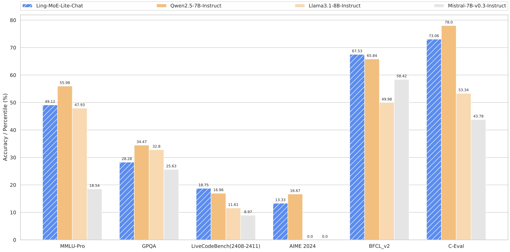

## 1. Introduction

We present Ling-moe, a strong Mixture-of-Experts (MoE) language model xxxxxxxxxxx
<p align="center">
  
</p>

## 2. Model Summary

---

**Compatibility of computing power**

- To avoid over-reliance on a specific training environ- ment, e.g., NVIDIA GPU series, and ensure compatibility with different training environments, e.g., Huawei GPU series, we propose a cross-platform training framework, namely dlrover, to train our MoE series on various computing devices.
-  We investigate a Multi-Token Prediction (MTP) objective and prove it beneficial to model performance. 
    It can also be used for speculative decoding for inference acceleration. 

---

**High-quality data**

- Throughout the entire training process, we take a series of strategies to clean and choose high-quality data. During pre-training, we train our MoE models on xxT high- quality tokens, involving different abilities, i.e., knowledge, language, reasoning (code, math, and logical reasoning), and xxx.

---

**High-performance inference**

- To speed up the generation of above-mentioned high-quality data, we delelop a high-performance inference framework, i.e., flood, which can increase the generation speed by more than 50% compared to vllm in data generation scenarios. Also, compared to other LLM models, high-performance inference capabilities offer significant advantages in practical application scenarios.

---


## 3. Model Downloads

<div align="center">

| **Model** | **#Total Params** | **#Activated Params** | **Context Length** | **Download** |
| :------------: | :------------: | :------------: | :------------: | :------------: |
| Ling-Moe-Lite-Base |  |  |    | link|
| Ling-Moe-Lite-Chat  |  |  |     | link|
| Ling-Moe-Plus-Base   |  |  |     |link|
| Ling-Moe-Plus-Chat |  |  |     |link|

</div>

## 4. Evaluation Results
### Base Model
#### Lite Benchmarks

<div align="center">

|  | Benchmark (Metric) | # Shots | DeepSeek-V2 | Qwen2.5 72B | LLaMA3.1 405B | DeepSeek-V3 |
|---|-------------------|----------|--------|-------------|---------------|---------|

</div>


#### Plus Benchmarks

<div align="center">

|  | Benchmark (Metric) | # Shots | DeepSeek-V2 | Qwen2.5 72B | LLaMA3.1 405B | DeepSeek-V3 |
|---|-------------------|----------|--------|-------------|---------------|---------|

</div>

The Bailing base model is pre-trained in a multilingual training set that includes both English and Chinese data. Therefore, we evaluate the performance of our base model using various datasets including both Chinese and English. Specifically, the evaluation benchmarks we utilize are categorized into the following 4 types, where Chinese benchmarks are underlined and English benchmarks are double-underlined.
For more evaluation details, please check our paper. 


### Chat Model
#### Lite Benchmarks
<div align="center">

| | **Benchmark (Metric)** | **DeepSeek V2-0506** | **DeepSeek V2.5-0905** | **Qwen2.5 72B-Inst.** | **Llama3.1 405B-Inst.** | **Claude-3.5-Sonnet-1022** | **GPT-4o 0513** | **DeepSeek V3** |
|---|---------------------|---------------------|----------------------|---------------------|----------------------|---------------------------|----------------|----------------|

Comparison between Bailing-MoE-Lite-Chat model and other representative models.
</div>

#### Plus Benchmarks
<div align="center">

| | **Benchmark (Metric)** | **DeepSeek V2-0506** | **DeepSeek V2.5-0905** | **Qwen2.5 72B-Inst.** | **Llama3.1 405B-Inst.** | **Claude-3.5-Sonnet-1022** | **GPT-4o 0513** | **DeepSeek V3** |
|---|---------------------|---------------------|----------------------|---------------------|----------------------|---------------------------|----------------|----------------|

Comparison between Bailing-MoE-Plus-Chat and other representative models.
</div>


## 5. How to Run Locally

Ling-moe can be deployed locally using the following hardware and open-source community software:

1. **LLama Factory Demo**: We provide a simple demo for training, inference and evaluation of model using LLama Factory.
2. **Huawei Ascend NPU**: Supports running Ling-moe on Huawei Ascend devices.

**NOTE: Huggingface's Transformers has not been directly supported yet.**

### 5.1 Inference with LLama Factory Demo (example only)

#### Model Weights & Demo Code Preparation

First, clone our inclusionAI GitHub repository:

```shell
git clone https://github.com/inclusionAI/moe.git
```

Clone LLaMA-Factory GitHub repository and install dependencies:

```
git clone --depth 1 https://github.com/hiyouga/LLaMA-Factory.git
cd LLaMA-Factory
pip install -e ".[torch,metrics]"
```

Download the model weights from HuggingFace, and put them into `/path/to/Ling_moe_lite` folder.

Use the following 3 commands to run Full fine-tuning, inference and eval of the Ling-moe-lite model, respectively.

```
llamafactory-cli train examples/train_sft/ling_full_sft.yaml
llamafactory-cli chat examples/inference/ling_full_sft.yaml
llamafactory-cli eval examples/merge_lora/ling_full_sft.yaml
```

### 5.2 Recommended Inference Functionality with Huawei Ascend NPUs
The [MindIE](https://www.hiascend.com/en/software/mindie) framework from the Huawei Ascend community has successfully adapted the BF16 version of DeepSeek-V3. For step-by-step guidance on Ascend NPUs, please follow the [instructions here](https://modelers.cn/models/MindIE/deepseekv3).


## 6. License
This code repository is licensed under [the MIT License](LICENSE-CODE). xxxx

## 7. Citation
```

```

## 8. Contact
If you have any questions, please raise an issue or contact us at xxx